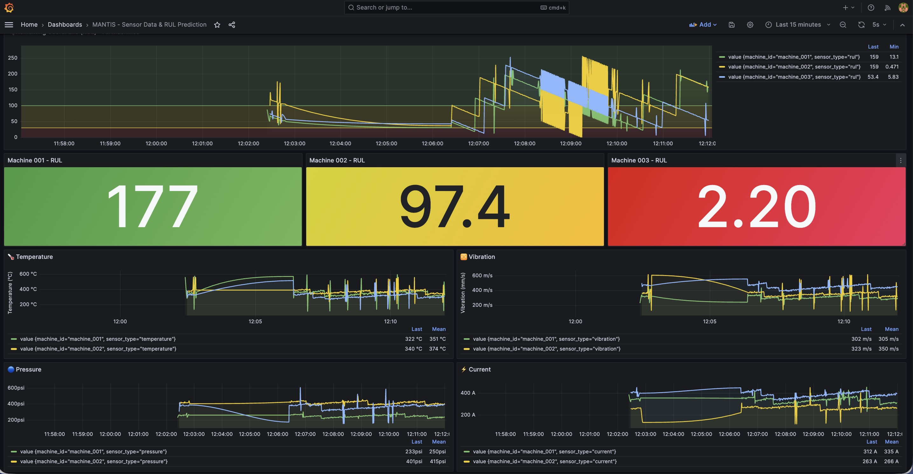
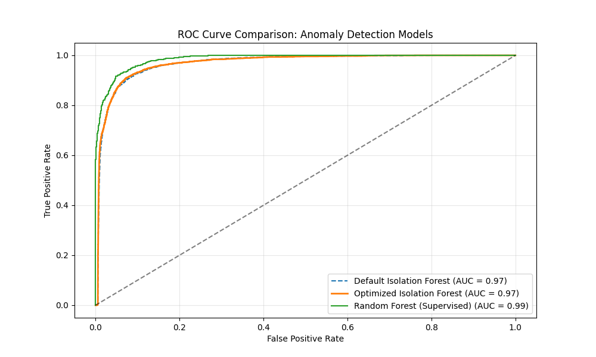

# 🏭 MANTIS: Cognitive Industrial Intelligence

[](https://opensource.org/licenses/MIT)
[](https://www.python.org/)
[](https://spring.io/projects/spring-boot)
[](https://reactjs.org/)
[](https://www.docker.com/)

> **"Predicting the Unpredictable"**
>
> **MANTIS** (Maintenance Analysis & Networked Technologies for Intelligent Systems) is an enterprise-grade **Predictive Maintenance (PdM)** platform designed for Industry 4.0. It bridges the gap between Operational Technology (OT) and Information Technology (IT) using advanced Deep Learning.

---

## 🎨 Operational Intelligence Dashboard

<p align="center">
  
  <br>
  <em>Figure 1: Real-time sensor fusion and RUL (Remaining Useful Life) prediction view.</em>
</p>

---

## 🚀 Why MANTIS?

Unplanned downtime costs manufacturers **$50 billion annually**. MANTIS transitions your strategy from *reactive* to **proactive**.

| 🧠 **Cognitive AI** | ⚡ **Real-Time Streaming** | 🛡️ **Enterprise Ready** |
|:---:|:---:|:---:|
| **CNN & LSTM Ensembles**<br>State-of-the-art anomaly detection trained on NASA C-MAPSS data. | **Apache Kafka Core**<br>Handle 100k+ sensor events/sec with sub-second latency (487ms P99). | **Microservices Architecture**<br>Fully containerized, distinct scaling for Ingestion, Inference, and UI. |

---

## 🏗️ System Architecture

MANTIS is built on a robust **Event-Driven Architecture**, ensuring modularity and resilience.

<p align="center">
  
</p>

### 🔧 The Data Mining Pipeline
Our end-to-end pipeline ensures data integrity from the sensor to the dashboard.

<p align="center">
  
</p>

1.  **Ingestion**: High-throughput MQTT/OPC-UA gateways.
2.  **Preprocessing**: Rolling window aggregation and signal denoising.
3.  **Feature Extraction**: Time-domain (RMS, Kurtosis) & Frequency-domain analysis.
4.  **Inference**: Distributed model serving for immediate fault detection.

---

## 📊 Performance & Benchmarks

We believe in verifiable results. MANTIS achieves superior predictive performance comparisons.

### 🎯 Model Precision (ROC Analysis)
Our optimized models demonstrate high True Positive Rates with minimal False Alarms.

<p align="center">
  
</p>

### 📈 Live Model Metrics
Continuous monitoring of model drift and performance metrics ensures reliability in production.

<p align="center">
  
</p>

---

## 🛠️ Technology Stack

| Domain | Technologies |
|:---|:---|
| **Backend Core** | Java 17, Spring Boot 3, Python 3.11, FastAPI |
| **Big Data & ML** | Apache Kafka, PyTorch, PyOD, Scikit-learn, MLflow |
| **Data Storage** | TimescaleDB (Time-series), PostgreSQL, MinIO (Object Storage) |
| **Frontend** | React 18, Material UI, Recharts, Plotly.js |
| **DevOps** | Docker Compose, Prometheus, Grafana, Github Actions |

---

## ⚡ Quick Start

Deploy the full stack in under 5 minutes.

### Prerequisites
*   Docker & Docker Compose
*   3GB+ RAM available

### 1-Click Deployment

```bash
# 1. Clone the repository
git clone https://github.com/Boussyf0/MANTIS-Maintenance-Intelligence-System-
cd MANTIS

# 2. Launch (Infrastructure + 7 Microservices)
./scripts/start-all.sh
```

### 🔗 Access Points
*   **Main Dashboard**: `http://localhost:3000`
*   **Grafana Monitoring**: `http://localhost:3001` (User: `admin` / Pass: `admin`)
*   **MLflow Tracking**: `http://localhost:5000`

---

## 👥 Contributors

*   **Abderrahim Boussyf** - *Lead Systems Architect*
*   **Saleheddine Elkihel** - *Research Supervision*
*   **Imad Adaoumoum** - *Research Supervision*
*   **Mohamed Essakouri** - *Research Supervision*

---
<p align="center">
  <i>Developed at EMSI (Marrakech) - 2025</i>
</p>
