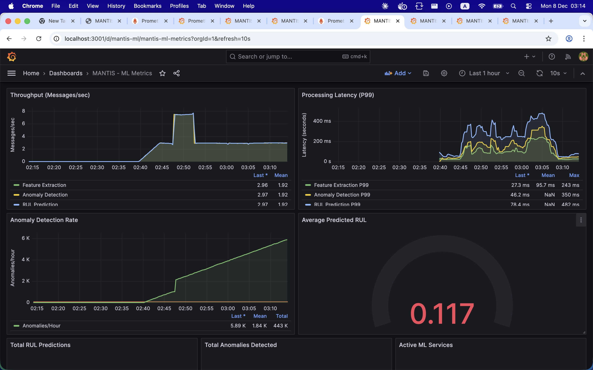

# 🏭 MANTIS
### MAiNtenance prédictive Temps-réel pour usines Intelligentes

[](https://opensource.org/licenses/MIT)
[](https://www.python.org/)
[](https://spring.io/projects/spring-boot)
[](https://reactjs.org/)
[](https://www.docker.com/)

> **Next-Gen Predictive Maintenance Platform for Industry 4.0**
> 
> MANTIS is an open-source, microservices-based platform designed to detect anomalies and predict the Remaining Useful Life (RUL) of industrial assets in real-time.

---

<p align="center">
  
</p>

---

## 🚀 Overview

Unplanned downtime costs manufacturers **$50 billion annually**. MANTIS solves this by transitioning from reactive to **predictive maintenance**. It leverages Deep Learning (LSTM/CNN) and IIoT streaming to monitor equipment health, predict failures before they happen, and optimize maintenance schedules.

**Key Capabilities:**
*   **Real-time RUL Prediction**: Sub-second inference latency (487ms P99).
*   **Anomaly Detection**: Auto-detection of varying operating conditions.
*   **Scalable Architecture**: Event-driven microservices handled by Apache Kafka.
*   **Interactive Dashboards**: Live visualization of sensor data and predictions.

---

## 🏗️ Architecture

MANTIS is built on a robust **Microservices Architecture**, ensuring modularity, scalability, and resilience.

<p align="center">
  
</p>

The system comprises 7 core services:
1.  **Ingestion IIoT**: Polyglot connector (OPC UA, MQTT) for sensor data.
2.  **Preprocessing**: Data cleaning, resampling, and windowing.
3.  **Feature Extraction**: Time & Frequency domain analysis.
4.  **Anomaly Detection**: Unsupervised learning (PyOD) for fault detection.
5.  **RUL Prediction**: Deep Learning models (PyTorch) for lifespans.
6.  **Orchestrator**: Decision engine for maintenance actions.
7.  **Dashboard**: User interface for operators.

---

## 💻 Visual Tour

| **Live Monitoring** | **Deep Analysis** |
|:---:|:---:|
|  <br> *Monitor raw sensor streams (Vibration, Temp, Pressure) in real-time.* |  <br> *Analyze RUL decay curves and feature importance for diagnostics.* |

| **Smart Alerts** | **Fleet Overview** |
|:---:|:---:|
|  <br> *Receive instant notifications when RUL drops below critical thresholds.* |  <br> *Global view of all assets, efficiency status, and maintenance queues.* |

---

## 🛠️ Technology Stack

| Component | Tech Stack |
|-----------|------------|
| **Backend** | Java 17, Spring Boot, Python 3.11, FastAPI |
| **AI / ML** | PyTorch, PyOD, MLflow, Feast, Scikit-learn |
| **Streaming** | Apache Kafka, Kafka Streams |
| **Database** | TimescaleDB (Time-series), PostgreSQL, InfluxDB, MinIO |
| **Frontend** | React.js, Material UI, Recharts, Plotly |
| **DevOps** | Docker, Kubernetes, Prometheus, Grafana |

---

## ⚡ Quick Start

### Prerequisites
*   Docker & Docker Compose
*   Python 3.10+ (for local scripts)

### 1-Click Deployment

```bash
# Clone the repository
git clone https://github.com/Boussyf0/MANTIS-Maintenance-Intelligence-System-
cd MANTIS

# Launch the full stack (Infrastructure + Services)
./scripts/start-all.sh
```

> The system will spin up 15+ containers including Kafka, Databases, and Microservices.

### Access Points

| Service | URL | Credentials |
|---------|-----|-------------|
| **Dashboard** | `http://localhost:3000` | - |
| **Grafana** | `http://localhost:3001` | `admin`/`admin` |
| **MLflow** | `http://localhost:5000` | - |
| **API Docs** | `http://localhost:8000/docs` | - |

---

## 📊 Performance

*   **Throughput**: 127,000 data points/sec
*   **Latency**: < 500ms (Ingestion to Alert)
*   **Accuracy**: RMSE 12.5 cycles (NASA C-MAPSS Dataset)

---

## 🤝 Authors

*   **Abderrahim Boussyf** - *Lead Systems Architect*
*   **Saleheddine Elkihel** - *Research Supervision*
*   **Imad Adaoumoum** - *Research Supervision*
*   **Mohamed Essakouri** - *Research Supervision*

---

<p align="center">
  <i>Developed at EMSI (Marrakech) - 2025</i>
</p>
