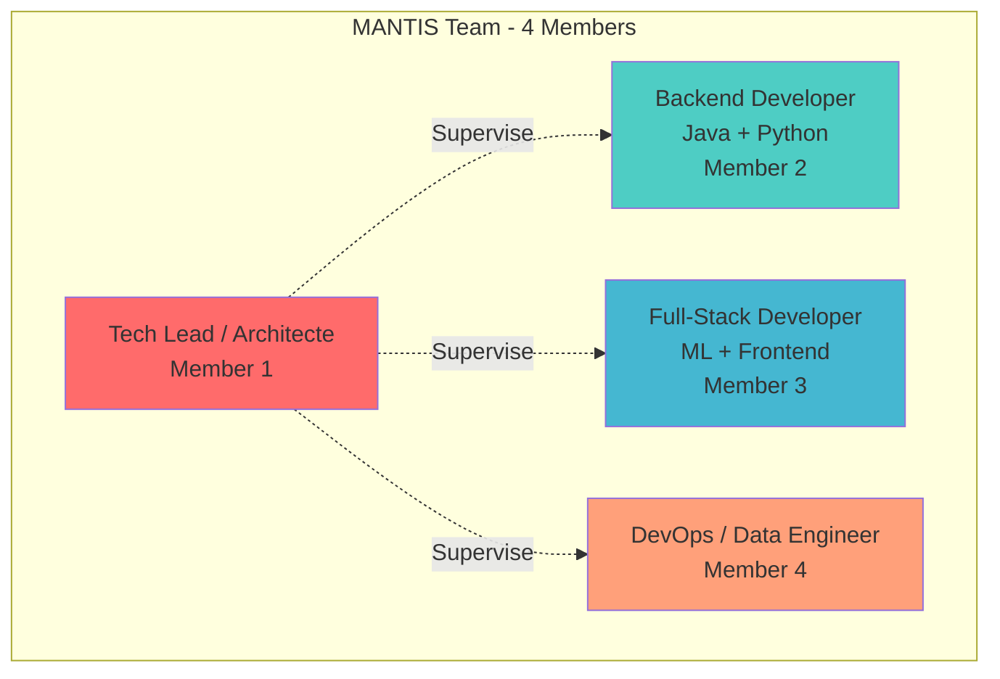
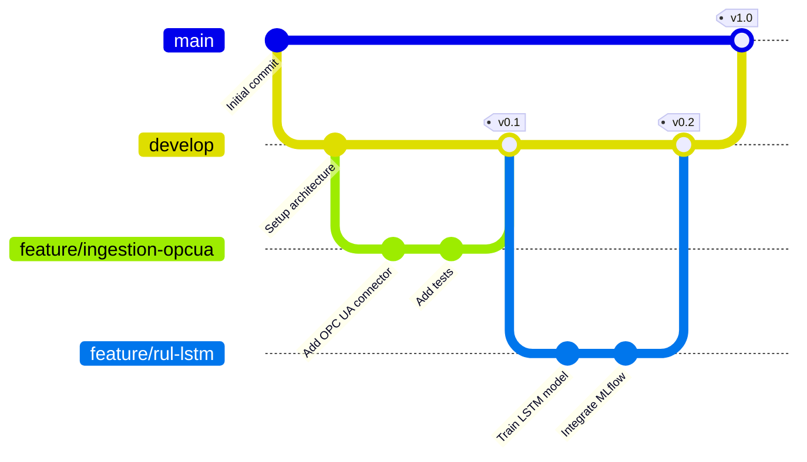
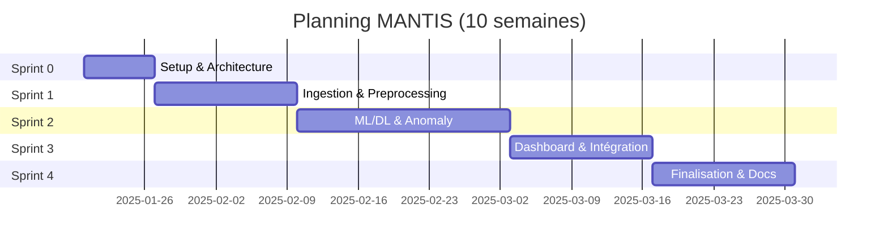

# MANTIS - Rôles et Responsabilités de l'Équipe

> **Projet académique EMSI** - Équipe de 4 membres
> **Objectif**: Développer une plateforme complète de maintenance prédictive en 10 semaines

---

## 📋 Table des matières

1. [Structure de l'équipe](#structure-de-léquipe)
2. [Rôles et responsabilités](#rôles-et-responsabilités)
3. [Matrice RACI](#matrice-raci)
4. [Planification par sprint](#planification-par-sprint)
5. [Outils de collaboration](#outils-de-collaboration)
6. [Processus de développement](#processus-de-développement)
7. [Critères de qualité](#critères-de-qualité)

---

## 👥 Structure de l'équipe

### Configuration recommandée (4 membres)



---

## 🎯 Rôles et Responsabilités

### 👨‍💼 Membre 1: Tech Lead / Architecte

**Nom**: ________________

**Responsabilités principales** (40% du temps):

#### Architecture & Conception
- ✅ Définir l'architecture globale (microservices, bases de données, messaging)
- ✅ Créer les diagrammes de conception (C4, UML, séquence)
- ✅ Valider les choix technologiques (Java vs Python, Kafka, etc.)
- ✅ Maintenir la documentation technique (ARCHITECTURE.md, DESIGN_DIAGRAMS.md)

#### Développement Backend Java
- ☕ **Service Ingestion IIoT** (Spring Boot)
  - Connecteurs OPC UA, MQTT, Modbus
  - Intégration Kafka Producer
  - Gestion résilience (Circuit Breaker, Retry)
- ☕ **Service Orchestrator** (Spring Boot + Drools)
  - Règles métier maintenance
  - Optimisation planning (OR-Tools)
  - Intégration CMMS/ERP

#### Gestion de Projet
- 📊 Planification des sprints (backlog, user stories)
- 🎯 Suivi de l'avancement (daily standups)
- 📝 Coordination avec les enseignants
- 🔍 Revue de code et merge des PR

**Technologies**:
- Java 17, Spring Boot 3.2, Maven
- Apache Kafka, PostgreSQL
- Eclipse Milo (OPC UA), Paho (MQTT)
- Drools (règles métier), OR-Tools (optimisation)
- Git, Docker, PlantUML

**Livrables**:
- ✅ Architecture complète documentée
- ✅ Service Ingestion IIoT fonctionnel
- ✅ Service Orchestrator avec règles métier
- ✅ Documentation technique (15+ pages)
- ✅ Diagrammes professionnels (20+)

**Temps estimé**: 120 heures (40% du projet)

---

### 👨‍💻 Membre 2: Backend Developer (Java + Python)

**Nom**: ________________

**Responsabilités principales** (35% du temps):

#### Service Preprocessing (Java)
- ☕ Développement du service Kafka Streams
  - Consumer topic `sensor.raw`
  - Nettoyage données (outliers, missing values)
  - Fenêtrage glissant (30s, 60s)
  - Filtres numériques (Butterworth, Savitzky-Golay)
  - Producer topic `sensor.windowed`
- ☕ Optimisation performance (> 100K msg/s)
- ☕ Tests unitaires et intégration

#### Service Anomaly Detection (Python)
- 🐍 Développement API FastAPI
  - Modèles ML: Isolation Forest, One-Class SVM
  - Autoencoder (PyTorch)
  - Agrégation multi-modèles
- 🐍 Intégration PyOD et scikit-learn
- 🐍 Gestion seuils adaptatifs par criticité
- 🐍 Consumer/Producer Kafka

#### Base de Données
- 📊 Implémentation schémas TimescaleDB
  - Hypertables (sensor_data_windowed, sensor_features)
  - Continuous aggregates (hourly, daily)
  - Compression et retention policies
- 📊 Requêtes optimisées pour séries temporelles

**Technologies**:
- Java 17, Spring Boot, Kafka Streams
- Python 3.11, FastAPI, PyOD, PyTorch
- TimescaleDB, PostgreSQL
- Docker, pytest, JUnit

**Livrables**:
- ✅ Service Preprocessing avec 4 filtres
- ✅ Service Anomaly Detection (3 modèles)
- ✅ Schémas TimescaleDB optimisés
- ✅ Tests avec couverture > 80%

**Temps estimé**: 105 heures (35% du projet)

---

### 👨‍🔬 Membre 3: Full-Stack Developer (ML + Frontend)

**Nom**: ________________

**Responsabilités principales** (35% du temps):

#### Service RUL Prediction (Python)
- 🐍 Développement modèles Deep Learning
  - LSTM/GRU (PyTorch)
  - TCN (Temporal Convolutional Network)
  - XGBoost (baseline)
- 🐍 Entraînement sur dataset NASA C-MAPSS
  - 4 sous-datasets (FD001-FD004)
  - Transfer learning vers actifs usine
- 🐍 Intégration MLOps
  - MLflow (tracking, registry)
  - Feast (feature store)
  - Uncertainty quantification
- 🐍 API FastAPI pour prédictions temps-réel

#### Service Feature Extraction (Python)
- 🐍 Développement pipeline features
  - Features temps (RMS, kurtosis, crest factor)
  - Features fréquence (FFT, STFT, spectral)
  - Features ondelettes (PyWavelets)
  - Intégration tsfresh
- 🐍 Feature Store (Feast + Redis)

#### Dashboard React
- ⚛️ Développement interface Next.js
  - Vue Overview (heatmap assets)
  - Vue Asset Detail (RUL, graphes temps-réel)
  - Vue Anomalies (historique, alertes)
  - Vue Maintenance (work orders, planning)
- ⚛️ Visualisations (Plotly.js, Recharts)
- ⚛️ WebSocket temps-réel (Kafka consumer)
- ⚛️ UI/UX avec TailwindCSS

**Technologies**:
- Python 3.11, PyTorch, XGBoost, tsfresh
- MLflow, Feast, MinIO
- React 18, Next.js 14, TailwindCSS
- Plotly.js, Recharts, D3.js
- WebSockets, REST API

**Livrables**:
- ✅ Modèle LSTM avec RMSE < 15 cycles
- ✅ Service Feature Extraction (30+ features)
- ✅ Dashboard React avec 4 vues
- ✅ MLflow pipeline complet
- ✅ Visualisations interactives

**Temps estimé**: 105 heures (35% du projet)

---

### 👨‍🔧 Membre 4: DevOps / Data Engineer

**Nom**: ________________

**Responsabilités principales** (30% du temps):

#### Infrastructure & DevOps
- 🐳 Configuration Docker Compose
  - 12 services (Kafka, DBs, MLflow, monitoring)
  - Health checks et restart policies
  - Volumes et networking
- ☸️ Manifests Kubernetes (optionnel)
  - Deployments, Services, ConfigMaps
  - StatefulSets (Kafka, PostgreSQL)
  - Ingress, PersistentVolumes
- 🔄 CI/CD GitHub Actions
  - Build et tests automatisés
  - Déploiement Docker images
  - Génération diagrammes

#### Monitoring & Observabilité
- 📈 Configuration Prometheus
  - Métriques applicatives (JVM, Python)
  - Métriques Kafka (JMX)
  - Alerting rules
- 📊 Dashboards Grafana
  - Dashboard infrastructure
  - Dashboard applicatif
  - Dashboard métier (MTBF, MTTR, OEE)
- 🔍 Tracing distribué (Jaeger)
  - Instrumentation services
  - Analyse latence E2E

#### Data Engineering
- 💾 Configuration bases de données
  - PostgreSQL (schéma initial, migrations)
  - TimescaleDB (hypertables, aggregates)
  - InfluxDB (high-frequency data)
  - Redis (feature store, cache)
- 📦 Object Storage (MinIO)
  - Buckets pour modèles ML
  - Données brutes archivées
- 🔄 Scripts ETL
  - Téléchargement dataset NASA C-MAPSS
  - Population données de test
  - Migrations schéma

#### Documentation Déploiement
- 📝 Guide d'installation (QUICKSTART.md)
- 📝 Guide de déploiement production
- 📝 Troubleshooting et FAQ

**Technologies**:
- Docker, Docker Compose, Kubernetes
- GitHub Actions, Bash scripting
- Prometheus, Grafana, Jaeger
- PostgreSQL, TimescaleDB, InfluxDB, Redis
- MinIO, Apache Kafka
- Terraform (optionnel)

**Livrables**:
- ✅ Docker Compose complet (12 services)
- ✅ Configuration Prometheus + Grafana
- ✅ 5 dashboards Grafana
- ✅ Scripts d'installation automatisés
- ✅ Pipeline CI/CD fonctionnel
- ✅ Documentation déploiement

**Temps estimé**: 90 heures (30% du projet)

---

## 📊 Matrice RACI

| Tâche | Tech Lead | Backend Dev | Full-Stack | DevOps |
|-------|-----------|-------------|------------|--------|
| **Architecture & Conception** |
| Définir architecture globale | **R/A** | C | C | C |
| Créer diagrammes UML/C4 | **R/A** | I | I | I |
| Choix technologiques | **A** | R | R | R |
| Documentation technique | **R/A** | C | C | C |
| **Services Backend Java** |
| Ingestion IIoT (OPC UA, MQTT) | **R/A** | C | I | I |
| Preprocessing (Kafka Streams) | C | **R/A** | I | C |
| Orchestrator (Drools) | **R/A** | C | I | I |
| **Services Python ML** |
| Feature Extraction | I | C | **R/A** | I |
| Anomaly Detection | C | **R/A** | C | I |
| RUL Prediction (LSTM) | I | I | **R/A** | I |
| MLOps (MLflow, Feast) | C | I | **R/A** | C |
| **Frontend** |
| Dashboard React | I | I | **R/A** | I |
| Visualisations temps-réel | I | I | **R/A** | I |
| **Infrastructure** |
| Docker Compose | C | I | I | **R/A** |
| Kubernetes (optionnel) | C | I | I | **R/A** |
| CI/CD Pipeline | C | C | C | **R/A** |
| **Bases de Données** |
| Schémas PostgreSQL | C | R | I | **A** |
| TimescaleDB (hypertables) | I | R | I | **A** |
| InfluxDB configuration | I | I | I | **R/A** |
| **Monitoring** |
| Prometheus setup | I | C | I | **R/A** |
| Grafana dashboards | C | C | C | **R/A** |
| Jaeger tracing | I | C | C | **R/A** |
| **Tests & Qualité** |
| Tests unitaires services | R | **R** | **R** | R |
| Tests intégration | **A** | R | R | R |
| Tests E2E | **A** | C | R | R |
| **Documentation** |
| README principal | **R/A** | C | C | C |
| QUICKSTART.md | C | C | C | **R/A** |
| API Documentation | C | **R** | **R** | I |
| **Gestion Projet** |
| Planification sprints | **R/A** | C | C | C |
| Daily standups | **A** | R | R | R |
| Revue de code | **A** | R | R | R |
| Rapport final | **A** | R | R | R |

**Légende**:
- **R** (Responsible): Fait le travail
- **A** (Accountable): Rend des comptes, approuve
- **C** (Consulted): Consulté, fournit input
- **I** (Informed): Informé des décisions

---

## 📅 Planification par Sprint

### Sprint 0: Setup & Architecture (1 semaine)

| Membre | Tâches | Temps |
|--------|--------|-------|
| **Tech Lead** | Architecture globale, diagrammes C4/UML, setup Git | 30h |
| **Backend Dev** | Setup projet Java/Python, config IDE | 20h |
| **Full-Stack** | Setup projet ML, exploration dataset C-MAPSS | 20h |
| **DevOps** | Docker Compose initial, DBs, Kafka | 25h |

**Livrables**:
- ✅ Repository Git configuré
- ✅ Architecture documentée (ARCHITECTURE.md)
- ✅ Docker Compose avec Kafka, PostgreSQL, TimescaleDB
- ✅ Exploration dataset C-MAPSS (notebook)

---

### Sprint 1: Ingestion & Preprocessing (2 semaines)

| Membre | Tâches | Temps |
|--------|--------|-------|
| **Tech Lead** | Service Ingestion (OPC UA, MQTT, Modbus) | 40h |
| **Backend Dev** | Service Preprocessing (Kafka Streams, filtres) | 40h |
| **Full-Stack** | Service Feature Extraction (tsfresh, features temps) | 35h |
| **DevOps** | Schémas TimescaleDB, métriques Prometheus | 30h |

**Livrables**:
- ✅ Service Ingestion avec 3 connecteurs IIoT
- ✅ Service Preprocessing (fenêtrage, filtres)
- ✅ Service Feature Extraction (10+ features)
- ✅ Hypertables TimescaleDB configurées

---

### Sprint 2: ML/DL & Anomaly Detection (3 semaines)

| Membre | Tâches | Temps |
|--------|--------|-------|
| **Tech Lead** | Service Orchestrator (Drools, OR-Tools) | 50h |
| **Backend Dev** | Service Anomaly Detection (PyOD, Autoencoder) | 45h |
| **Full-Stack** | Modèles RUL (LSTM, TCN, XGBoost), MLflow | 50h |
| **DevOps** | MLflow setup, MinIO, Grafana dashboards | 35h |

**Livrables**:
- ✅ Service Anomaly Detection (3 modèles)
- ✅ Modèle LSTM avec RMSE < 15 cycles
- ✅ Service Orchestrator avec règles métier
- ✅ MLflow pipeline complet

---

### Sprint 3: Dashboard & Intégration (2 semaines)

| Membre | Tâches | Temps |
|--------|--------|-------|
| **Tech Lead** | Intégration CMMS/ERP (mocks), tests E2E | 30h |
| **Backend Dev** | Tests intégration, optimisation performance | 30h |
| **Full-Stack** | Dashboard React (4 vues), WebSocket | 40h |
| **DevOps** | CI/CD GitHub Actions, Kubernetes (optionnel) | 30h |

**Livrables**:
- ✅ Dashboard React avec 4 vues
- ✅ Intégration E2E fonctionnelle
- ✅ Pipeline CI/CD automatisé
- ✅ Tests avec couverture > 80%

---

### Sprint 4: Finalisation & Documentation (2 semaines)

| Membre | Tâches | Temps |
|--------|--------|-------|
| **Tech Lead** | Rapport final, présentation, vidéo démo | 30h |
| **Backend Dev** | Documentation API, guide développeur | 20h |
| **Full-Stack** | Documentation utilisateur, tutoriels | 20h |
| **DevOps** | Guide déploiement, troubleshooting | 20h |

**Tous ensemble**: Préparation présentation finale (10h chacun)

**Livrables**:
- ✅ Rapport final (30+ pages)
- ✅ Présentation PowerPoint
- ✅ Vidéo démo (10 minutes)
- ✅ Documentation complète (100+ pages)
- ✅ Code source avec README complet

---

## 🛠️ Outils de Collaboration

### Communication

| Outil | Usage | Responsable |
|-------|-------|-------------|
| **Slack / Discord** | Communication quotidienne | Tous |
| **Google Meet / Zoom** | Daily standup (15 min/jour) | Tech Lead |
| **Email** | Communication formelle enseignants | Tech Lead |

### Gestion de Projet

| Outil | Usage | Responsable |
|-------|-------|-------------|
| **GitHub Projects** | Kanban board, backlog | Tech Lead |
| **GitHub Issues** | Tracking bugs, features | Tous |
| **GitHub Milestones** | Suivi sprints | Tech Lead |

### Développement

| Outil | Usage | Responsable |
|-------|-------|-------------|
| **Git / GitHub** | Versioning code | Tous |
| **GitHub Actions** | CI/CD | DevOps |
| **VS Code** | IDE principal | Tous |
| **IntelliJ IDEA** | IDE Java (optionnel) | Backend Dev, Tech Lead |
| **Docker Desktop** | Containers locaux | Tous |

### Documentation

| Outil | Usage | Responsable |
|-------|-------|-------------|
| **Markdown** | Documentation technique | Tous |
| **PlantUML** | Diagrammes UML | Tech Lead |
| **Mermaid** | Diagrammes dans markdown | Tech Lead |
| **Jupyter** | Notebooks exploration | Full-Stack |
| **Google Docs** | Rapport final | Tous |

---

## 🔄 Processus de Développement

### Git Workflow (GitHub Flow)



### Conventions

**Branches**:
- `main` - Production, stable
- `develop` - Intégration continue
- `feature/nom-feature` - Nouvelle fonctionnalité
- `bugfix/nom-bug` - Correction bug
- `docs/nom-doc` - Documentation

**Commits**:
```bash
# Format: <type>(<scope>): <message>

feat(ingestion): add OPC UA connector
fix(rul): correct LSTM input shape
docs(architecture): update sequence diagrams
test(anomaly): add unit tests for Isolation Forest
refactor(preprocessing): optimize window aggregation
```

**Pull Requests**:
1. Créer PR depuis feature branch → develop
2. Assigner 1 reviewer (Tech Lead ou pair)
3. Vérifier CI/CD passe (tests, build)
4. Obtenir approbation
5. Squash & merge
6. Supprimer branch

### Code Review Checklist

- [ ] Code suit les conventions (PEP 8, Java Code Style)
- [ ] Tests unitaires ajoutés (couverture > 80%)
- [ ] Documentation mise à jour (docstrings, README)
- [ ] Pas de secrets hardcodés (credentials, API keys)
- [ ] Logs appropriés (niveaux DEBUG, INFO, ERROR)
- [ ] Performance acceptable (latence, mémoire)
- [ ] Pas de dépendances inutiles

---

## ✅ Critères de Qualité

### Code Quality

| Métrique | Objectif | Outil |
|----------|----------|-------|
| **Couverture tests** | > 80% | pytest-cov, JaCoCo |
| **Linting Python** | Score A | pylint, black |
| **Linting Java** | 0 violations | Checkstyle, SonarLint |
| **Complexité cyclomatique** | < 10 | radon, PMD |
| **Duplication code** | < 5% | SonarQube |

### Performance

| KPI | Objectif | Comment mesurer |
|-----|----------|------------------|
| **Latence E2E** | < 5 secondes | Jaeger tracing |
| **Débit ingestion** | > 100K points/s | Prometheus metrics |
| **Latence prédiction RUL** | < 100ms | FastAPI metrics |
| **Utilisation CPU** | < 70% | Grafana dashboards |
| **Utilisation mémoire** | < 80% | Grafana dashboards |

### Métier

| KPI | Objectif | Dataset |
|-----|----------|---------|
| **RMSE RUL** | < 15 cycles | NASA C-MAPSS |
| **Précision anomalies** | > 85% | Données test |
| **Recall anomalies** | > 90% | Données test |
| **F1-Score** | > 0.87 | Données test |

---

## 📞 Contacts

### Équipe

| Rôle | Nom | Email | Téléphone | Disponibilité |
|------|-----|-------|-----------|---------------|
| **Tech Lead** | _______ | _______ | _______ | Lun-Ven 9h-18h |
| **Backend Dev** | _______ | _______ | _______ | Lun-Ven 10h-19h |
| **Full-Stack** | _______ | _______ | _______ | Lun-Ven 14h-22h |
| **DevOps** | _______ | _______ | _______ | Lun-Sam 8h-17h |

### Encadrement

| Fonction | Nom | Email | Disponibilité |
|----------|-----|-------|---------------|
| **Encadrant principal** | Pr. Oumayma OUEDRHIRI | O.ouedrhiri@emsi.ma | Sur RDV |
| **Co-encadrant** | Pr. Hiba TABBAA | H.Tabbaa@emsi.ma | Sur RDV |
| **Référent technique** | Pr. Mohamed LACHGAR | lachgar.m@gmail.com | Sur RDV |

---

## 📈 Suivi de l'Avancement

### Métriques de Projet



### Burndown Chart (exemple Sprint 1)

| Jour | Tâches restantes | Idéal | Réel |
|------|------------------|-------|------|
| Jour 1 | 40 | 40 | 40 |
| Jour 3 | 36 | 36 | 38 |
| Jour 5 | 30 | 30 | 32 |
| Jour 7 | 24 | 24 | 25 |
| Jour 10 | 15 | 15 | 18 |
| Jour 14 | 0 | 0 | 2 |

---

## 🎓 Compétences Développées par Rôle

### Tech Lead
- ✅ Architecture microservices
- ✅ Conception orientée objet (UML, C4)
- ✅ Java enterprise (Spring Boot, Maven)
- ✅ Gestion de projet Agile
- ✅ Leadership technique

### Backend Developer
- ✅ Streaming temps-réel (Kafka, Kafka Streams)
- ✅ Bases de données temps-réel (TimescaleDB)
- ✅ Machine Learning (PyOD, scikit-learn)
- ✅ APIs REST (Spring Boot, FastAPI)
- ✅ Tests et qualité code

### Full-Stack Developer
- ✅ Deep Learning (PyTorch, LSTM/TCN)
- ✅ MLOps (MLflow, Feast)
- ✅ Frontend moderne (React, Next.js)
- ✅ Visualisation données (Plotly, D3.js)
- ✅ Feature engineering

### DevOps
- ✅ Containerisation (Docker, Kubernetes)
- ✅ CI/CD (GitHub Actions)
- ✅ Monitoring (Prometheus, Grafana)
- ✅ Data engineering (ETL, DBs)
- ✅ Infrastructure as Code

---

**Version**: 1.0.0
**Date**: 2025-01-21
**Dernière mise à jour**: Sprint 0

**Validé par**:
- [ ] Tech Lead: _________________
- [ ] Backend Developer: _________________
- [ ] Full-Stack Developer: _________________
- [ ] DevOps: _________________
- [ ] Encadrant: Pr. Oumayma OUEDRHIRI
