# MANTIS - Diagrammes de Conception

> **Objectif**: Fournir une vision partagée et professionnelle de l'architecture MANTIS pour toute l'équipe

## Table des matières

1. [Vue d'ensemble](#1-vue-densemble)
2. [Architecture C4](#2-architecture-c4)
3. [Diagrammes de séquence](#3-diagrammes-de-séquence)
4. [Diagramme de déploiement](#4-diagramme-de-déploiement)
5. [Modèle de données](#5-modèle-de-données)
6. [Flux de messages Kafka](#6-flux-de-messages-kafka)

---

## 1. Vue d'ensemble

### 1.1 Architecture globale

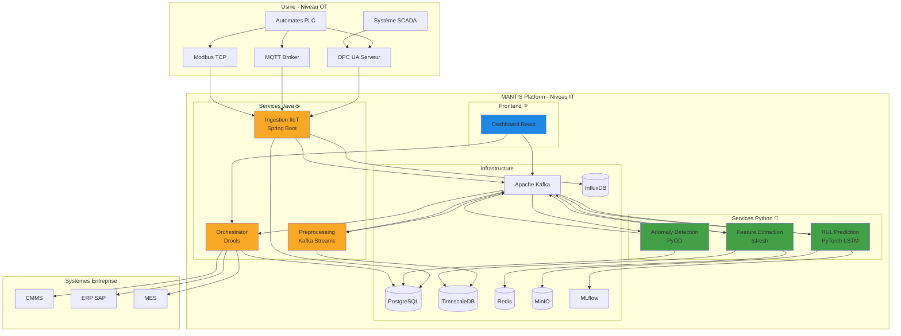

### 1.2 Légende des services

| Service | Langage | Rôle Principal | Port |
|---------|---------|----------------|------|
| **Ingestion IIoT** ☕ | Java/Spring Boot | Collecte données OPC UA, MQTT, Modbus | 8001 |
| **Preprocessing** ☕ | Java/Kafka Streams | Nettoyage, fenêtrage, filtrage | 8002 |
| **Feature Extraction** 🐍 | Python/FastAPI | Extraction features temps/fréquence | 8003 |
| **Anomaly Detection** 🐍 | Python/FastAPI | Détection anomalies ML | 8004 |
| **RUL Prediction** 🐍 | Python/FastAPI | Prédiction RUL (LSTM/TCN) | 8005 |
| **Orchestrator** ☕ | Java/Spring Boot | Règles métier, planification | 8006 |
| **Dashboard** ⚛️ | React/Next.js | Interface utilisateur | 3000 |

---

## 2. Architecture C4

### 2.1 Niveau 1 - Contexte système

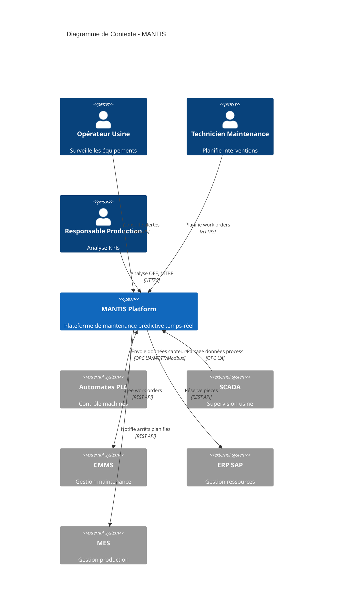

### 2.2 Niveau 2 - Conteneurs

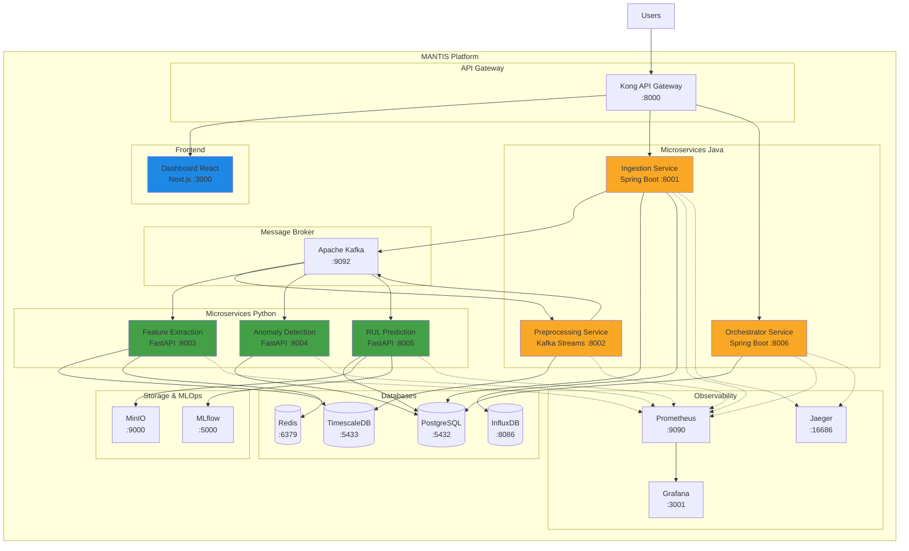

### 2.3 Niveau 3 - Composants (Service Ingestion)

```mermaid
graph TB
    subgraph "Ingestion IIoT Service"
        subgraph "Controllers"
            REST[REST Controller<br/>@RestController]
            HEALTH[Health Controller<br/>@RestController]
        end

        subgraph "Connectors"
            OPCUA[OPC UA Connector<br/>Eclipse Milo]
            MQTT_C[MQTT Connector<br/>Eclipse Paho]
            MODBUS[Modbus Connector<br/>modbus4j]
        end

        subgraph "Services"
            KAFKA_P[Kafka Producer Service<br/>@Service]
            EDGE[Edge Buffer Service<br/>@Service]
            VALID[Validation Service<br/>@Service]
        end

        subgraph "Models"
            SENSOR[SensorData<br/>@Data @Builder]
            CONFIG[ConnectorConfig<br/>@Configuration]
        end

        subgraph "Resilience"
            CB[Circuit Breaker<br/>@CircuitBreaker]
            RETRY[Retry Policy<br/>@Retry]
        end
    end

    EXT[Équipements IIoT] --> OPCUA
    EXT --> MQTT_C
    EXT --> MODBUS

    OPCUA --> VALID
    MQTT_C --> VALID
    MODBUS --> VALID

    VALID --> SENSOR
    SENSOR --> KAFKA_P

    KAFKA_P --> CB
    CB --> KAFKA[Apache Kafka]
    CB -- échec --> EDGE

    KAFKA_P --> RETRY

    REST --> KAFKA_P
    HEALTH --> KAFKA_P

    CONFIG --> OPCUA
    CONFIG --> MQTT_C
    CONFIG --> MODBUS

    style OPCUA fill:#ff9800
    style MQTT_C fill:#ff9800
    style MODBUS fill:#ff9800
    style KAFKA_P fill:#4caf50
    style EDGE fill:#f44336
```

---

## 3. Diagrammes de séquence

### 3.1 Flux complet: Ingestion → Prédiction RUL → Alerte

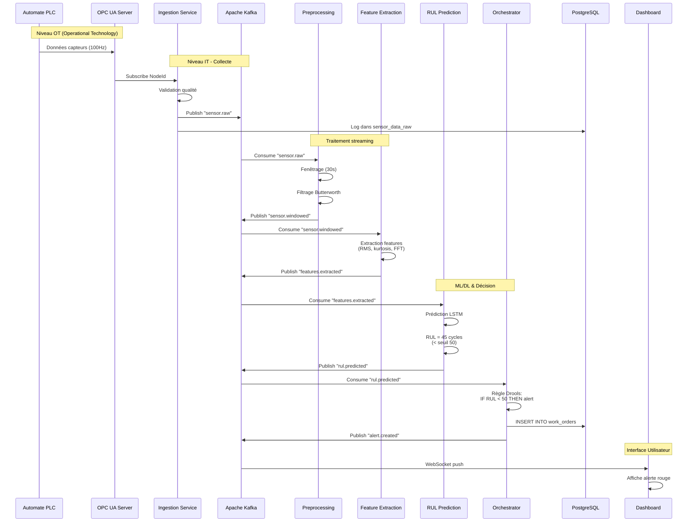

### 3.2 Détection d'anomalie avec fallback

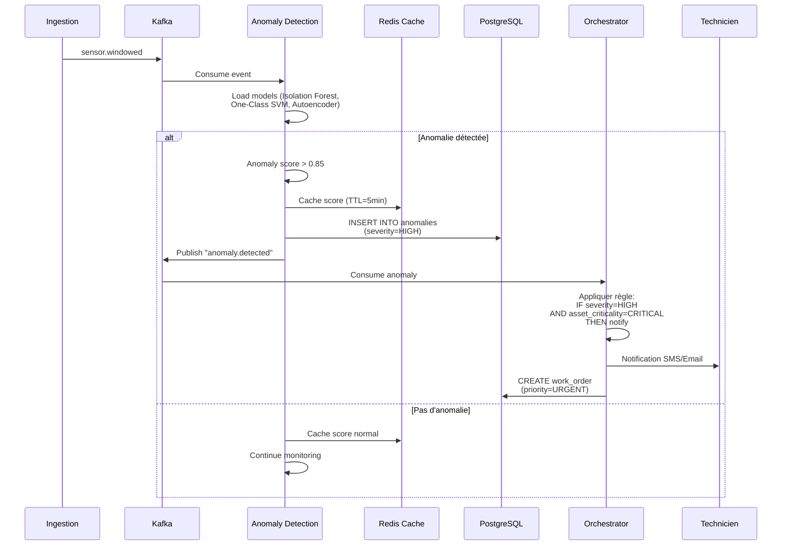

### 3.3 Planification maintenance optimale

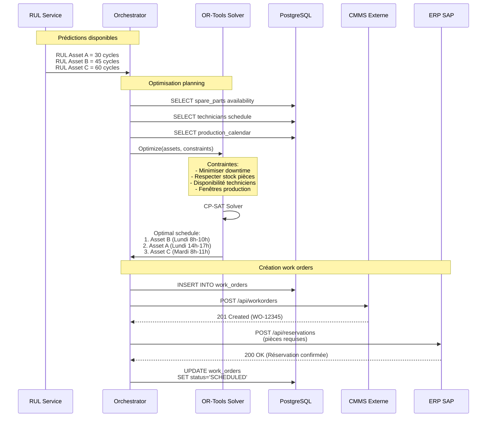

---

## 4. Diagramme de déploiement

### 4.1 Architecture Kubernetes (Production)

```mermaid
graph TB
    subgraph "Cluster Kubernetes"
        subgraph "Namespace: mantis-ingestion"
            ING_POD1[Ingestion Pod 1<br/>☕ Java]
            ING_POD2[Ingestion Pod 2<br/>☕ Java]
            ING_POD3[Ingestion Pod 3<br/>☕ Java]
            ING_SVC[Service: ingestion-svc<br/>ClusterIP]

            ING_POD1 --> ING_SVC
            ING_POD2 --> ING_SVC
            ING_POD3 --> ING_SVC
        end

        subgraph "Namespace: mantis-processing"
            PRE_POD1[Preprocessing Pod 1<br/>☕ Kafka Streams]
            PRE_POD2[Preprocessing Pod 2<br/>☕ Kafka Streams]

            FEX_POD1[Feature Extraction Pod 1<br/>🐍 Python]
            FEX_POD2[Feature Extraction Pod 2<br/>🐍 Python]
            FEX_SVC[Service: feature-svc]

            FEX_POD1 --> FEX_SVC
            FEX_POD2 --> FEX_SVC
        end

        subgraph "Namespace: mantis-ml"
            ANO_POD1[Anomaly Pod 1<br/>🐍 PyOD]
            ANO_POD2[Anomaly Pod 2<br/>🐍 PyOD]
            ANO_SVC[Service: anomaly-svc]

            RUL_POD1[RUL Pod 1<br/>🐍 PyTorch GPU]
            RUL_POD2[RUL Pod 2<br/>🐍 PyTorch GPU]
            RUL_SVC[Service: rul-svc]

            ANO_POD1 --> ANO_SVC
            ANO_POD2 --> ANO_SVC
            RUL_POD1 --> RUL_SVC
            RUL_POD2 --> RUL_SVC
        end

        subgraph "Namespace: mantis-orchestration"
            ORC_POD1[Orchestrator Pod 1<br/>☕ Java]
            ORC_POD2[Orchestrator Pod 2<br/>☕ Java]
            ORC_SVC[Service: orchestrator-svc]

            ORC_POD1 --> ORC_SVC
            ORC_POD2 --> ORC_SVC
        end

        subgraph "Namespace: mantis-frontend"
            DASH_POD1[Dashboard Pod 1<br/>⚛️ React]
            DASH_POD2[Dashboard Pod 2<br/>⚛️ React]
            DASH_POD3[Dashboard Pod 3<br/>⚛️ React]
            DASH_SVC[Service: dashboard-svc]

            DASH_POD1 --> DASH_SVC
            DASH_POD2 --> DASH_SVC
            DASH_POD3 --> DASH_SVC
        end

        subgraph "Namespace: mantis-data"
            KAFKA_SS[Kafka StatefulSet<br/>3 replicas]
            ZK_SS[Zookeeper StatefulSet<br/>3 replicas]

            PG_SS[PostgreSQL StatefulSet<br/>Primary + 2 Replicas]
            TS_SS[TimescaleDB StatefulSet<br/>Primary + 1 Replica]
            INF_SS[InfluxDB StatefulSet]
            REDIS_SS[Redis StatefulSet<br/>Master + 2 Replicas]

            KAFKA_SS --> ZK_SS
        end

        subgraph "Namespace: mantis-storage"
            MINIO_SS[MinIO StatefulSet<br/>4 nodes distributed]
            MLF_DEP[MLflow Deployment]
        end

        subgraph "Namespace: mantis-monitoring"
            PROM_SS[Prometheus StatefulSet]
            GRAF_DEP[Grafana Deployment]
            JAEG_DEP[Jaeger Deployment]
        end

        INGRESS[Ingress Controller<br/>nginx]
    end

    subgraph "Persistent Storage"
        PV_KAFKA[PV: kafka-data<br/>500Gi SSD]
        PV_PG[PV: postgres-data<br/>200Gi SSD]
        PV_TS[PV: timescale-data<br/>1Ti SSD]
        PV_MINIO[PV: minio-data<br/>2Ti HDD]
    end

    KAFKA_SS --> PV_KAFKA
    PG_SS --> PV_PG
    TS_SS --> PV_TS
    MINIO_SS --> PV_MINIO

    INTERNET[Internet] --> INGRESS
    INGRESS --> DASH_SVC
    INGRESS --> ING_SVC

    style ING_POD1 fill:#f9a825
    style PRE_POD1 fill:#f9a825
    style ORC_POD1 fill:#f9a825
    style FEX_POD1 fill:#43a047
    style ANO_POD1 fill:#43a047
    style RUL_POD1 fill:#43a047
    style DASH_POD1 fill:#1e88e5
```

### 4.2 Ressources Kubernetes (Quotas)

| Service | CPU Request | CPU Limit | Memory Request | Memory Limit | Replicas | GPU |
|---------|-------------|-----------|----------------|--------------|----------|-----|
| Ingestion | 500m | 2000m | 512Mi | 2Gi | 3 | - |
| Preprocessing | 1000m | 4000m | 1Gi | 4Gi | 2 | - |
| Feature Extraction | 500m | 2000m | 1Gi | 4Gi | 2 | - |
| Anomaly Detection | 1000m | 3000m | 2Gi | 6Gi | 2 | - |
| RUL Prediction | 2000m | 4000m | 4Gi | 16Gi | 2 | 1x Tesla T4 |
| Orchestrator | 500m | 2000m | 1Gi | 3Gi | 2 | - |
| Dashboard | 200m | 1000m | 256Mi | 1Gi | 3 | - |
| Kafka | 2000m | 4000m | 4Gi | 8Gi | 3 | - |
| PostgreSQL | 1000m | 4000m | 2Gi | 8Gi | 3 | - |
| TimescaleDB | 2000m | 6000m | 4Gi | 16Gi | 2 | - |

---

## 5. Modèle de données

### 5.1 ERD PostgreSQL (Métadonnées)

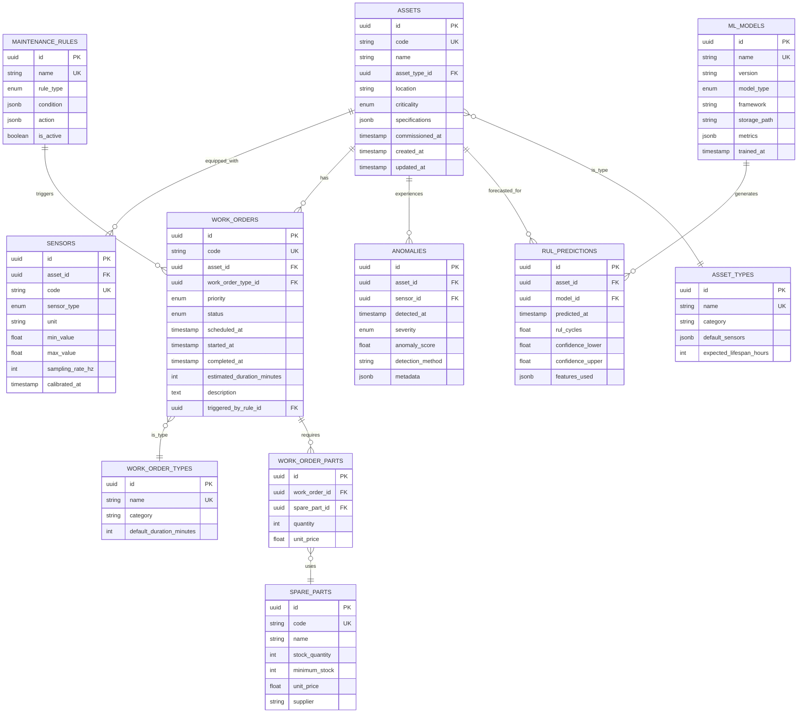

### 5.2 Schéma TimescaleDB (Séries temporelles)

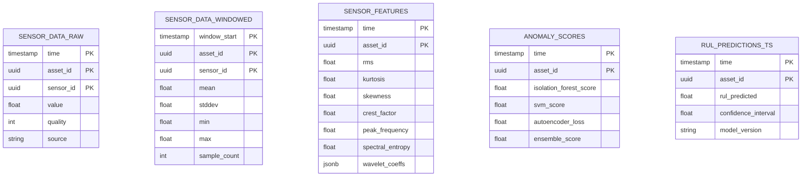

---

## 6. Flux de messages Kafka

### 6.1 Topics et schémas

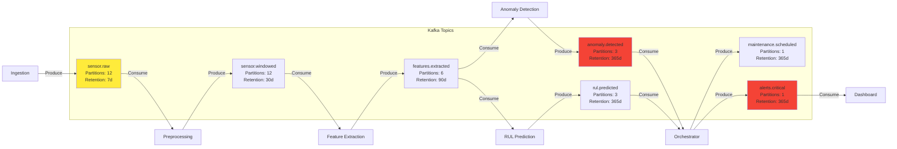

### 6.2 Schéma message Avro (sensor.raw)

```json
{
  "type": "record",
  "name": "SensorData",
  "namespace": "com.mantis.avro",
  "fields": [
    {
      "name": "timestamp",
      "type": {
        "type": "long",
        "logicalType": "timestamp-millis"
      }
    },
    {
      "name": "assetId",
      "type": "string"
    },
    {
      "name": "sensorId",
      "type": "string"
    },
    {
      "name": "sensorCode",
      "type": "string"
    },
    {
      "name": "sensorType",
      "type": {
        "type": "enum",
        "name": "SensorType",
        "symbols": [
          "TEMPERATURE",
          "VIBRATION",
          "PRESSURE",
          "CURRENT",
          "SPEED",
          "FLOW"
        ]
      }
    },
    {
      "name": "value",
      "type": "double"
    },
    {
      "name": "unit",
      "type": "string"
    },
    {
      "name": "quality",
      "type": "int",
      "default": 100
    },
    {
      "name": "source",
      "type": {
        "type": "enum",
        "name": "SourceProtocol",
        "symbols": [
          "OPC_UA",
          "MQTT",
          "MODBUS_TCP"
        ]
      }
    },
    {
      "name": "metadata",
      "type": [
        "null",
        {
          "type": "map",
          "values": "string"
        }
      ],
      "default": null
    }
  ]
}
```

### 6.3 Stratégie de partitionnement

| Topic | Clé de partition | Raison |
|-------|------------------|--------|
| `sensor.raw` | `assetId` | Garantir ordre des événements par asset |
| `sensor.windowed` | `assetId` | Maintenir localité temporelle |
| `features.extracted` | `assetId` | Co-location pour ML |
| `anomaly.detected` | `severity + assetId` | Prioriser anomalies critiques |
| `rul.predicted` | `assetId` | Cohérence prédictions |
| `alerts.critical` | `null` (round-robin) | Distribution équitable |

---

## 7. Diagrammes de flux de données

### 7.1 Pipeline ML - Training (Offline)

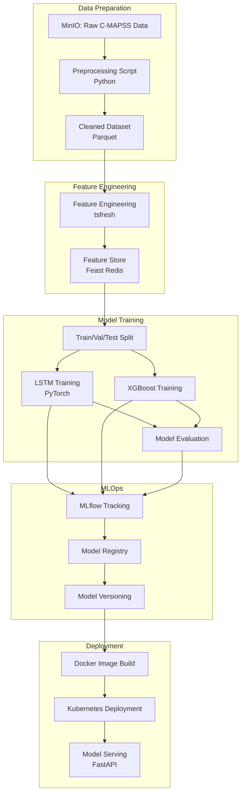

### 7.2 Pipeline ML - Inference (Online)

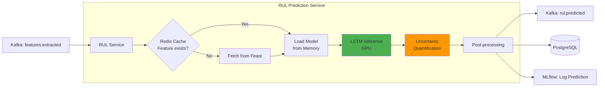

---

## 8. Matrices de décision

### 8.1 Matrice de routage des événements

| Condition | Topic Source | Topic Destination | Consumer | Action |
|-----------|--------------|-------------------|----------|--------|
| Anomaly score > 0.85 | `anomaly.detected` | `alerts.critical` | Orchestrator | Créer work order urgent |
| RUL < 50 cycles | `rul.predicted` | `maintenance.scheduled` | Orchestrator | Planifier maintenance |
| Quality < 50 | `sensor.raw` | `data.quality.issues` | Monitoring | Alerter admin |
| Asset criticality = CRITICAL | `anomaly.detected` | `alerts.critical` | SMS Service | Notifier technicien |

### 8.2 Matrice de criticité des assets

| Type Asset | Criticité | RUL Seuil | Anomaly Seuil | Temps Réponse Max |
|------------|-----------|-----------|---------------|-------------------|
| Moteur principal | CRITICAL | 50 cycles | 0.75 | 2 heures |
| Pompe hydraulique | HIGH | 100 cycles | 0.80 | 8 heures |
| Convoyeur | MEDIUM | 200 cycles | 0.85 | 24 heures |
| Ventilateur | LOW | 500 cycles | 0.90 | 1 semaine |

---

## 9. Patterns d'architecture

### 9.1 Event Sourcing Pattern

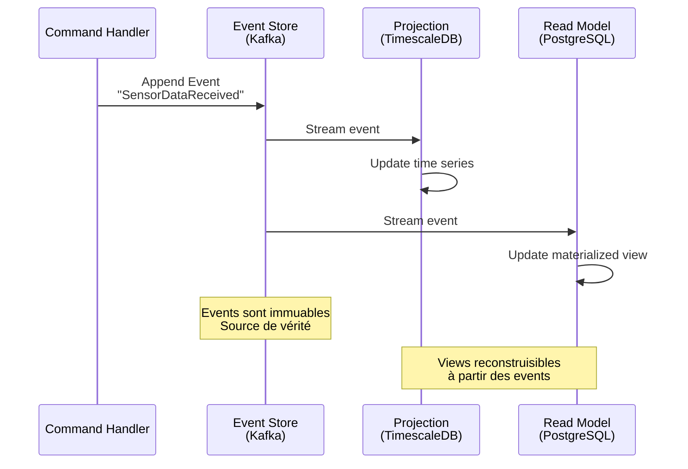

### 9.2 Circuit Breaker Pattern

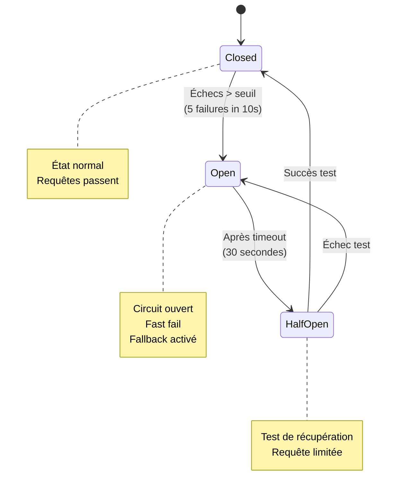

### 9.3 Saga Pattern (Maintenance Scheduling)

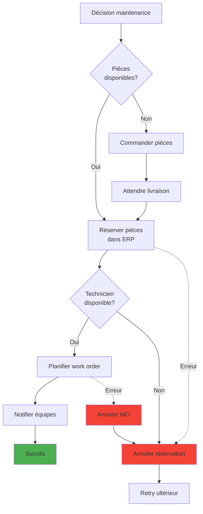

---

## 10. Documentation des interfaces

### 10.1 API REST - Ingestion Service

```yaml
openapi: 3.0.0
info:
  title: MANTIS Ingestion API
  version: 1.0.0

paths:
  /api/v1/sensors/data:
    post:
      summary: Envoyer des données capteur
      requestBody:
        content:
          application/json:
            schema:
              $ref: '#/components/schemas/SensorData'
      responses:
        '202':
          description: Accepté pour traitement
        '400':
          description: Données invalides
        '503':
          description: Service indisponible (buffered)

  /api/v1/connectors/opcua/status:
    get:
      summary: Statut connecteur OPC UA
      responses:
        '200':
          description: Statut OK
          content:
            application/json:
              schema:
                type: object
                properties:
                  status:
                    type: string
                    enum: [CONNECTED, DISCONNECTED, ERROR]
                  activeNodes:
                    type: integer
                  messagesPerSecond:
                    type: number

components:
  schemas:
    SensorData:
      type: object
      required:
        - timestamp
        - assetId
        - sensorId
        - value
      properties:
        timestamp:
          type: string
          format: date-time
        assetId:
          type: string
          format: uuid
        sensorId:
          type: string
          format: uuid
        value:
          type: number
        unit:
          type: string
```

---

## Conclusion

Ces diagrammes fournissent une **vision partagée et professionnelle** de l'architecture MANTIS. Ils doivent être mis à jour à chaque évolution majeure du système.

### Utilisation recommandée

1. **Onboarding nouveaux développeurs**: Commencer par les diagrammes C4 (contexte → conteneurs → composants)
2. **Revues de conception**: Utiliser les diagrammes de séquence pour valider les flux
3. **Planification déploiement**: S'appuyer sur le diagramme Kubernetes
4. **Développement features**: Référencer l'ERD et les schémas Kafka

### Outils de visualisation

- **Mermaid Live Editor**: https://mermaid.live (pour éditer les diagrammes)
- **PlantUML**: Pour diagrammes UML plus complexes
- **Draw.io**: Pour diagrammes personnalisés

### Maintenance

- **Responsable**: Architecture team
- **Fréquence de revue**: Mensuelle
- **Versioning**: Géré dans Git avec le code

---

**Dernière mise à jour**: 2025-01-21
**Version**: 1.0.0
**Auteur**: MANTIS Architecture Team
