# MANTIS - Diagrammes de Conception

> **Objectif**: Fournir une vision partagée et professionnelle de l'architecture MANTIS pour toute l'équipe

## Table des matières

1. [Vue d'ensemble](#1-vue-densemble)
2. [Architecture C4](#2-architecture-c4)
3. [Diagrammes de séquence](#3-diagrammes-de-séquence)
4. [Diagramme de déploiement](#4-diagramme-de-déploiement)
5. [Modèle de données](#5-modèle-de-données)
6. [Flux de messages Kafka](#6-flux-de-messages-kafka)

---

## 1. Vue d'ensemble

### 1.1 Architecture globale


### 1.2 Légende des services

| Service | Langage | Rôle Principal | Port |
|---------|---------|----------------|------|
| **Ingestion IIoT** ☕ | Java/Spring Boot | Collecte données OPC UA, MQTT, Modbus | 8001 |
| **Preprocessing** ☕ | Java/Kafka Streams | Nettoyage, fenêtrage, filtrage | 8002 |
| **Feature Extraction** 🐍 | Python/FastAPI | Extraction features temps/fréquence | 8003 |
| **Anomaly Detection** 🐍 | Python/FastAPI | Détection anomalies ML | 8004 |
| **RUL Prediction** 🐍 | Python/FastAPI | Prédiction RUL (LSTM/TCN) | 8005 |
| **Orchestrator** ☕ | Java/Spring Boot | Règles métier, planification | 8006 |
| **Dashboard** ⚛️ | React/Next.js | Interface utilisateur | 3000 |

---

## 2. Architecture C4

### 2.1 Niveau 1 - Contexte système

```mermaid
C4Context
    title Diagramme de Contexte - MANTIS

    Person(operator, "Opérateur Usine", "Surveille les équipements")
    Person(maint, "Technicien Maintenance", "Planifie interventions")
    Person(manager, "Responsable Production", "Analyse KPIs")

    System(mantis, "MANTIS Platform", "Plateforme de maintenance prédictive temps-réel")

    System_Ext(plc, "Automates PLC", "Contrôle machines")
    System_Ext(scada, "SCADA", "Supervision usine")
    System_Ext(cmms, "CMMS", "Gestion maintenance")
    System_Ext(erp, "ERP SAP", "Gestion ressources")
    System_Ext(mes, "MES", "Gestion production")

    Rel(operator, mantis, "Consulte alertes", "HTTPS")
    Rel(maint, mantis, "Planifie work orders", "HTTPS")
    Rel(manager, mantis, "Analyse OEE, MTBF", "HTTPS")

    Rel(plc, mantis, "Envoie données capteurs", "OPC UA/MQTT/Modbus")
    Rel(scada, mantis, "Partage données process", "OPC UA")

    Rel(mantis, cmms, "Crée work orders", "REST API")
    Rel(mantis, erp, "Réserve pièces", "REST API")
    Rel(mantis, mes, "Notifie arrêts planifiés", "REST API")

    UpdateLayoutConfig($c4ShapeInRow="3", $c4BoundaryInRow="1")
```



### 2.2 Niveau 2 - Conteneurs


### 2.3 Niveau 3 - Composants (Service Ingestion)

```mermaid
graph TB
    subgraph "Ingestion IIoT Service"
        subgraph "Controllers"
            REST[REST Controller<br/>@RestController]
            HEALTH[Health Controller<br/>@RestController]
        end

        subgraph "Connectors"
            OPCUA[OPC UA Connector<br/>Eclipse Milo]
            MQTT_C[MQTT Connector<br/>Eclipse Paho]
            MODBUS[Modbus Connector<br/>modbus4j]
        end

        subgraph "Services"
            KAFKA_P[Kafka Producer Service<br/>@Service]
            EDGE[Edge Buffer Service<br/>@Service]
            VALID[Validation Service<br/>@Service]
        end

        subgraph "Models"
            SENSOR[SensorData<br/>@Data @Builder]
            CONFIG[ConnectorConfig<br/>@Configuration]
        end

        subgraph "Resilience"
            CB[Circuit Breaker<br/>@CircuitBreaker]
            RETRY[Retry Policy<br/>@Retry]
        end
    end

    EXT[Équipements IIoT] --> OPCUA
    EXT --> MQTT_C
    EXT --> MODBUS

    OPCUA --> VALID
    MQTT_C --> VALID
    MODBUS --> VALID

    VALID --> SENSOR
    SENSOR --> KAFKA_P

    KAFKA_P --> CB
    CB --> KAFKA[Apache Kafka]
    CB -- échec --> EDGE

    KAFKA_P --> RETRY

    REST --> KAFKA_P
    HEALTH --> KAFKA_P

    CONFIG --> OPCUA
    CONFIG --> MQTT_C
    CONFIG --> MODBUS

    style OPCUA fill:#ff9800
    style MQTT_C fill:#ff9800
    style MODBUS fill:#ff9800
    style KAFKA_P fill:#4caf50
    style EDGE fill:#f44336
```

---

## 3. Diagrammes de séquence

### 3.1 Flux complet: Ingestion → Prédiction RUL → Alerte

```mermaid
sequenceDiagram
    participant PLC as Automate PLC
    participant OPC as OPC UA Server
    participant ING as Ingestion Service
    participant KAFKA as Apache Kafka
    participant PRE as Preprocessing
    participant FEX as Feature Extraction
    participant RUL as RUL Prediction
    participant ORC as Orchestrator
    participant DB as PostgreSQL
    participant DASH as Dashboard

    Note over PLC,OPC: Niveau OT (Operational Technology)
    PLC->>OPC: Données capteurs (100Hz)

    Note over ING,KAFKA: Niveau IT - Collecte
    OPC->>ING: Subscribe NodeId
    ING->>ING: Validation qualité
    ING->>KAFKA: Publish "sensor.raw"
    ING->>DB: Log dans sensor_data_raw

    Note over PRE,FEX: Traitement streaming
    KAFKA->>PRE: Consume "sensor.raw"
    PRE->>PRE: Fenêtrage (30s)
    PRE->>PRE: Filtrage Butterworth
    PRE->>KAFKA: Publish "sensor.windowed"

    KAFKA->>FEX: Consume "sensor.windowed"
    FEX->>FEX: Extraction features<br/>(RMS, kurtosis, FFT)
    FEX->>KAFKA: Publish "features.extracted"

    Note over RUL,ORC: ML/DL & Décision
    KAFKA->>RUL: Consume "features.extracted"
    RUL->>RUL: Prédiction LSTM
    RUL->>RUL: RUL = 45 cycles<br/>(< seuil 50)
    RUL->>KAFKA: Publish "rul.predicted"

    KAFKA->>ORC: Consume "rul.predicted"
    ORC->>ORC: Règle Drools:<br/>IF RUL < 50 THEN alert
    ORC->>DB: INSERT INTO work_orders
    ORC->>KAFKA: Publish "alert.created"

    Note over DASH: Interface Utilisateur
    KAFKA->>DASH: WebSocket push
    DASH->>DASH: Affiche alerte rouge
```



### 3.2 Détection d'anomalie avec fallback

```mermaid
sequenceDiagram
    participant ING as Ingestion
    participant KAFKA as Kafka
    participant ANO as Anomaly Detection
    participant REDIS as Redis Cache
    participant DB as PostgreSQL
    participant ORC as Orchestrator
    participant TECH as Technicien

    ING->>KAFKA: sensor.windowed
    KAFKA->>ANO: Consume event

    ANO->>ANO: Load models (Isolation Forest,<br/>One-Class SVM, Autoencoder)

    alt Anomalie détectée
        ANO->>ANO: Anomaly score > 0.85
        ANO->>REDIS: Cache score (TTL=5min)
        ANO->>DB: INSERT INTO anomalies<br/>(severity=HIGH)
        ANO->>KAFKA: Publish "anomaly.detected"

        KAFKA->>ORC: Consume anomaly
        ORC->>ORC: Appliquer règle:<br/>IF severity=HIGH<br/>AND asset_criticality=CRITICAL<br/>THEN notify
        ORC->>TECH: Notification SMS/Email
        ORC->>DB: CREATE work_order<br/>(priority=URGENT)
    else Pas d'anomalie
        ANO->>REDIS: Cache score normal
        ANO->>ANO: Continue monitoring
    end
```



### 3.3 Planification maintenance optimale


---

## 4. Diagramme de déploiement

### 4.1 Architecture Kubernetes (Production)

```mermaid
graph TB
    subgraph "Cluster Kubernetes"
        subgraph "Namespace: mantis-ingestion"
            ING_POD1[Ingestion Pod 1<br/>☕ Java]
            ING_POD2[Ingestion Pod 2<br/>☕ Java]
            ING_POD3[Ingestion Pod 3<br/>☕ Java]
            ING_SVC[Service: ingestion-svc<br/>ClusterIP]

            ING_POD1 --> ING_SVC
            ING_POD2 --> ING_SVC
            ING_POD3 --> ING_SVC
        end

        subgraph "Namespace: mantis-processing"
            PRE_POD1[Preprocessing Pod 1<br/>☕ Kafka Streams]
            PRE_POD2[Preprocessing Pod 2<br/>☕ Kafka Streams]

            FEX_POD1[Feature Extraction Pod 1<br/>🐍 Python]
            FEX_POD2[Feature Extraction Pod 2<br/>🐍 Python]
            FEX_SVC[Service: feature-svc]

            FEX_POD1 --> FEX_SVC
            FEX_POD2 --> FEX_SVC
        end

        subgraph "Namespace: mantis-ml"
            ANO_POD1[Anomaly Pod 1<br/>🐍 PyOD]
            ANO_POD2[Anomaly Pod 2<br/>🐍 PyOD]
            ANO_SVC[Service: anomaly-svc]

            RUL_POD1[RUL Pod 1<br/>🐍 PyTorch GPU]
            RUL_POD2[RUL Pod 2<br/>🐍 PyTorch GPU]
            RUL_SVC[Service: rul-svc]

            ANO_POD1 --> ANO_SVC
            ANO_POD2 --> ANO_SVC
            RUL_POD1 --> RUL_SVC
            RUL_POD2 --> RUL_SVC
        end

        subgraph "Namespace: mantis-orchestration"
            ORC_POD1[Orchestrator Pod 1<br/>☕ Java]
            ORC_POD2[Orchestrator Pod 2<br/>☕ Java]
            ORC_SVC[Service: orchestrator-svc]

            ORC_POD1 --> ORC_SVC
            ORC_POD2 --> ORC_SVC
        end

        subgraph "Namespace: mantis-frontend"
            DASH_POD1[Dashboard Pod 1<br/>⚛️ React]
            DASH_POD2[Dashboard Pod 2<br/>⚛️ React]
            DASH_POD3[Dashboard Pod 3<br/>⚛️ React]
            DASH_SVC[Service: dashboard-svc]

            DASH_POD1 --> DASH_SVC
            DASH_POD2 --> DASH_SVC
            DASH_POD3 --> DASH_SVC
        end

        subgraph "Namespace: mantis-data"
            KAFKA_SS[Kafka StatefulSet<br/>3 replicas]
            ZK_SS[Zookeeper StatefulSet<br/>3 replicas]

            PG_SS[PostgreSQL StatefulSet<br/>Primary + 2 Replicas]
            TS_SS[TimescaleDB StatefulSet<br/>Primary + 1 Replica]
            INF_SS[InfluxDB StatefulSet]
            REDIS_SS[Redis StatefulSet<br/>Master + 2 Replicas]

            KAFKA_SS --> ZK_SS
        end

        subgraph "Namespace: mantis-storage"
            MINIO_SS[MinIO StatefulSet<br/>4 nodes distributed]
            MLF_DEP[MLflow Deployment]
        end

        subgraph "Namespace: mantis-monitoring"
            PROM_SS[Prometheus StatefulSet]
            GRAF_DEP[Grafana Deployment]
            JAEG_DEP[Jaeger Deployment]
        end

        INGRESS[Ingress Controller<br/>nginx]
    end

    subgraph "Persistent Storage"
        PV_KAFKA[PV: kafka-data<br/>500Gi SSD]
        PV_PG[PV: postgres-data<br/>200Gi SSD]
        PV_TS[PV: timescale-data<br/>1Ti SSD]
        PV_MINIO[PV: minio-data<br/>2Ti HDD]
    end

    KAFKA_SS --> PV_KAFKA
    PG_SS --> PV_PG
    TS_SS --> PV_TS
    MINIO_SS --> PV_MINIO

    INTERNET[Internet] --> INGRESS
    INGRESS --> DASH_SVC
    INGRESS --> ING_SVC

    style ING_POD1 fill:#f9a825
    style PRE_POD1 fill:#f9a825
    style ORC_POD1 fill:#f9a825
    style FEX_POD1 fill:#43a047
    style ANO_POD1 fill:#43a047
    style RUL_POD1 fill:#43a047
    style DASH_POD1 fill:#1e88e5
```



### 4.2 Ressources Kubernetes (Quotas)

| Service | CPU Request | CPU Limit | Memory Request | Memory Limit | Replicas | GPU |
|---------|-------------|-----------|----------------|--------------|----------|-----|
| Ingestion | 500m | 2000m | 512Mi | 2Gi | 3 | - |
| Preprocessing | 1000m | 4000m | 1Gi | 4Gi | 2 | - |
| Feature Extraction | 500m | 2000m | 1Gi | 4Gi | 2 | - |
| Anomaly Detection | 1000m | 3000m | 2Gi | 6Gi | 2 | - |
| RUL Prediction | 2000m | 4000m | 4Gi | 16Gi | 2 | 1x Tesla T4 |
| Orchestrator | 500m | 2000m | 1Gi | 3Gi | 2 | - |
| Dashboard | 200m | 1000m | 256Mi | 1Gi | 3 | - |
| Kafka | 2000m | 4000m | 4Gi | 8Gi | 3 | - |
| PostgreSQL | 1000m | 4000m | 2Gi | 8Gi | 3 | - |
| TimescaleDB | 2000m | 6000m | 4Gi | 16Gi | 2 | - |

---

## 5. Modèle de données

### 5.1 ERD PostgreSQL (Métadonnées)


### 5.2 Schéma TimescaleDB (Séries temporelles)


---

## 6. Flux de messages Kafka

### 6.1 Topics et schémas


### 6.2 Schéma message Avro (sensor.raw)

```json
{
  "type": "record",
  "name": "SensorData",
  "namespace": "com.mantis.avro",
  "fields": [
    {
      "name": "timestamp",
      "type": {
        "type": "long",
        "logicalType": "timestamp-millis"
      }
    },
    {
      "name": "assetId",
      "type": "string"
    },
    {
      "name": "sensorId",
      "type": "string"
    },
    {
      "name": "sensorCode",
      "type": "string"
    },
    {
      "name": "sensorType",
      "type": {
        "type": "enum",
        "name": "SensorType",
        "symbols": [
          "TEMPERATURE",
          "VIBRATION",
          "PRESSURE",
          "CURRENT",
          "SPEED",
          "FLOW"
        ]
      }
    },
    {
      "name": "value",
      "type": "double"
    },
    {
      "name": "unit",
      "type": "string"
    },
    {
      "name": "quality",
      "type": "int",
      "default": 100
    },
    {
      "name": "source",
      "type": {
        "type": "enum",
        "name": "SourceProtocol",
        "symbols": [
          "OPC_UA",
          "MQTT",
          "MODBUS_TCP"
        ]
      }
    },
    {
      "name": "metadata",
      "type": [
        "null",
        {
          "type": "map",
          "values": "string"
        }
      ],
      "default": null
    }
  ]
}
```

### 6.3 Stratégie de partitionnement

| Topic | Clé de partition | Raison |
|-------|------------------|--------|
| `sensor.raw` | `assetId` | Garantir ordre des événements par asset |
| `sensor.windowed` | `assetId` | Maintenir localité temporelle |
| `features.extracted` | `assetId` | Co-location pour ML |
| `anomaly.detected` | `severity + assetId` | Prioriser anomalies critiques |
| `rul.predicted` | `assetId` | Cohérence prédictions |
| `alerts.critical` | `null` (round-robin) | Distribution équitable |

---

## 7. Diagrammes de flux de données

### 7.1 Pipeline ML - Training (Offline)


### 7.2 Pipeline ML - Inference (Online)


---

## 8. Matrices de décision

### 8.1 Matrice de routage des événements

| Condition | Topic Source | Topic Destination | Consumer | Action |
|-----------|--------------|-------------------|----------|--------|
| Anomaly score > 0.85 | `anomaly.detected` | `alerts.critical` | Orchestrator | Créer work order urgent |
| RUL < 50 cycles | `rul.predicted` | `maintenance.scheduled` | Orchestrator | Planifier maintenance |
| Quality < 50 | `sensor.raw` | `data.quality.issues` | Monitoring | Alerter admin |
| Asset criticality = CRITICAL | `anomaly.detected` | `alerts.critical` | SMS Service | Notifier technicien |

### 8.2 Matrice de criticité des assets

| Type Asset | Criticité | RUL Seuil | Anomaly Seuil | Temps Réponse Max |
|------------|-----------|-----------|---------------|-------------------|
| Moteur principal | CRITICAL | 50 cycles | 0.75 | 2 heures |
| Pompe hydraulique | HIGH | 100 cycles | 0.80 | 8 heures |
| Convoyeur | MEDIUM | 200 cycles | 0.85 | 24 heures |
| Ventilateur | LOW | 500 cycles | 0.90 | 1 semaine |

---

## 9. Patterns d'architecture

### 9.1 Event Sourcing Pattern


### 9.2 Circuit Breaker Pattern

```mermaid
stateDiagram-v2
    [*] --> Closed

    Closed --> Open: Échecs > seuil<br/>(5 failures in 10s)
    Open --> HalfOpen: Après timeout<br/>(30 secondes)
    HalfOpen --> Closed: Succès test
    HalfOpen --> Open: Échec test

    note right of Closed
        État normal
        Requêtes passent
    end note

    note right of Open
        Circuit ouvert
        Fast fail
        Fallback activé
    end note

    note right of HalfOpen
        Test de récupération
        Requête limitée
    end note
```



### 9.3 Saga Pattern (Maintenance Scheduling)


---

## 10. Documentation des interfaces

### 10.1 API REST - Ingestion Service

```yaml
openapi: 3.0.0
info:
  title: MANTIS Ingestion API
  version: 1.0.0

paths:
  /api/v1/sensors/data:
    post:
      summary: Envoyer des données capteur
      requestBody:
        content:
          application/json:
            schema:
              $ref: '#/components/schemas/SensorData'
      responses:
        '202':
          description: Accepté pour traitement
        '400':
          description: Données invalides
        '503':
          description: Service indisponible (buffered)

  /api/v1/connectors/opcua/status:
    get:
      summary: Statut connecteur OPC UA
      responses:
        '200':
          description: Statut OK
          content:
            application/json:
              schema:
                type: object
                properties:
                  status:
                    type: string
                    enum: [CONNECTED, DISCONNECTED, ERROR]
                  activeNodes:
                    type: integer
                  messagesPerSecond:
                    type: number

components:
  schemas:
    SensorData:
      type: object
      required:
        - timestamp
        - assetId
        - sensorId
        - value
      properties:
        timestamp:
          type: string
          format: date-time
        assetId:
          type: string
          format: uuid
        sensorId:
          type: string
          format: uuid
        value:
          type: number
        unit:
          type: string
```

---

## Conclusion

Ces diagrammes fournissent une **vision partagée et professionnelle** de l'architecture MANTIS. Ils doivent être mis à jour à chaque évolution majeure du système.

### Utilisation recommandée

1. **Onboarding nouveaux développeurs**: Commencer par les diagrammes C4 (contexte → conteneurs → composants)
2. **Revues de conception**: Utiliser les diagrammes de séquence pour valider les flux
3. **Planification déploiement**: S'appuyer sur le diagramme Kubernetes
4. **Développement features**: Référencer l'ERD et les schémas Kafka

### Outils de visualisation

- **Mermaid Live Editor**: https://mermaid.live (pour éditer les diagrammes)
- **PlantUML**: Pour diagrammes UML plus complexes
- **Draw.io**: Pour diagrammes personnalisés

### Maintenance

- **Responsable**: Architecture team
- **Fréquence de revue**: Mensuelle
- **Versioning**: Géré dans Git avec le code

---

**Dernière mise à jour**: 2025-01-21
**Version**: 1.0.0
**Auteur**: MANTIS Architecture Team
